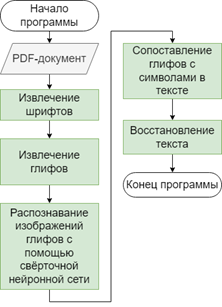
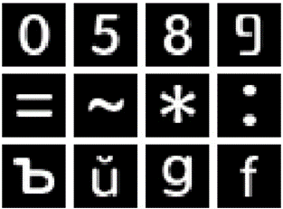
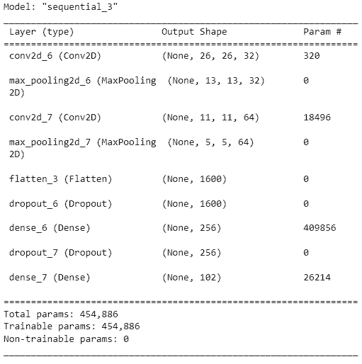
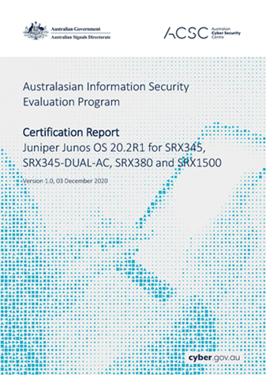

# PDF-w-Bg-Txtract

Проект предназначенный для извлечения текста из PDF-документов. Формат PDF представляет собой удобный инструмент для хранения и передачи документов. Преобразование документов и текстов в формат PDF не требует значительных усилий. Однако, преобразование данных из формата PDF обратно в исходный формат может представлять сложность из-за особенностей хранения информации в PDF и отсутствия простых и эффективных инструментов для выполнения таких операций.

<!-- Предложенный в проекте подход позволяет избежать проблем при извлечении текста из PDF-документов со сложным фоном, фоновыми элементами и некорректной кодировкой. -->
Предложенный в проекте подход для извлечения текста из PDF-документов основан на анализе потока вывода текстовой информации формата PDF, что позволяет эффективно извлекать текст при работе с документами со сложной структурой, фоновыми элементами и некорректной кодировкой.

## Шаги алгоритма



### 1. Извлечение шрифтов

Из PDF-документа извлекаются все необходимые для восстановления текста шрифта.

### 2. Извлечение глифов

Из раннее извлеченных шрифтов извлекаются все визуальные представления символов (глифы)

### 3. Распознование изображений глифов с помощью свёрточной нейронной сети

Сверточные нейронные сети (CNN) особенно эффективны для задач распознавания образов, таких как распознавание глифов. Уже обученная CNN используется для идентификации глифов в извлеченных изображениях

### 4. Сопоставление глифов с символами в тексте

После того как глифы были идентифицированы, они сопоставляются с соответствующими символами в тексте.

### 5. Восстановление текста

После сопоставления всех глифов с символами текст может быть восстановлен.

## CNN

### Информация о датасете

Формат изображений в наборе данных:

1. Одноканальные
2. 28x28 пикселей
3. Инвертированные цвета

Всего 286 различных шрифтов из которых извлекали 102 класса изображений разделенные на три выборки в следующем соотношении:

1. **Train** - 195 шрифтов, 20420 изображений (70%)
2. **Validation** - 72 шрифта, 7584 изображений (26%)
3. **Test** - 14 шрифтов, 1168 изображений (4%)

Каждому классу изображений соответствует одинаковое число изображений.

Пример:


### Архитектура CNN

Модель CNN сделана при помощи фрейморка TensorFlow. Используемая CNN имеет следующую архитектуру:



### Параметры обучения CNN

* Количество эпох - 20
* Batch Size - 2000
* Скорость обучения - 1e-3
* оптимизатор - Adam
* loss function - categorical_crossentropy

### Результаты обучения

|  | Train | Validation | Test |
|----------|----------|----------|----------|
| **rus+eng**    | 78%   | 77%   | 80% |
|  **rus** | 96%   | 89%   | 93% |
| **eng**    | 93%   | 92%   | 94% |

rus+eng имеет худшие результаты из-за омоглифов (похожие или идентичные буквы) русского и английского языка.

| Англ. | a|b|c|e|h|k|m|n|o|p|r|t|u|x|y|
| -- | --|--|--|--|--|--|--|--|--|--|--|--|--|--|--|
| **Рус.** | **а**|**б**|**с**|**е**|**н**|**к**|**м**|**п**|**о**|**р**|**г**|**т**|**и**|**х**|**у**|

## Оценка эффективности

Для проведения тестирования были найдены документы, содержащие текстовый слой,
который характеризуется сложным фоном или структурой.

Пример:


Для оценки эффективности применялся метод, основанный на метрике Левенштейна.
Результаты оценки эффективности в сравнении с проектом [Dedoc](https://github.com/ispras/dedoc) использующим OCR Tesseract. Текст извлеченный при помощи предложенного в проекте подхода и OCR Tesseract в Dedoc сравнивался с эталонным текстом для PDF-документа, хранящимся в json-файле.

Ссылка с PDF-документами и соответствующими им json-файлами: https://disk.yandex.ru/d/3ACE21IWjEuyUg

В таблице указывается имя PDF-документа, который участвовал в тестировании и полученное значение **Accuracy**, всего 14 документов, 12442 символов.

|  | Dedoc | Количество символов| Предложенный подход |
|----------|----------|----------|--|
Integratable isolation system |1281| 68%| 96%|
Брошюра Ростелеком |102| 0%| 71%|
Кафетерий льгот |608| 31%| 99%|
Брошюра StationGuard |1774| 55%| 99%|
Спецификация военного двухканального радио |2406| 62%| 98%|
Руководство по визуальному оформлению |130| 55%| 97%|
Брошюра для родителей детей до 5 лет |125| 0%| 99%|
Брошюра Biesse |347| 17%| 99%|
Брошюра, описывающая механизм подотчетности Asia Development Bank |265| 51%| 99%|
Exploration of Windows Vista Advanced Forensic Topics |393| 72%| 93%|
Средство Engineer Documentation Assistant – помощник в работе со сложной документацией |2380| 78%| 97%
Australasian Information Security Evaluation Program |175| 39%| 91%|
Canadian center for cyber security |166| 92%| 91%|
Мобильные компьютеры корпоративного класса |2290| 80%| 97%|
Средняя точность |  |50%| 95%|

## Требования

### Версия Python

`python3.8`

### FontForge

`20230101`

### Установить зависимости

```bash
pip install -r requirments.txt
```

## Извлечение текста

Для извлечения текста открыть терминал в папке проекта и написать

```bash
python text-extractor.py --pdf_path path/to/pdf --model_name ruseng
```
### Параметры

1. `pdf_path`: путь до PDF-документа
2. `model_name`: rus/eng/rus+eng (Заранее обученные модели CNN)


### Модели

#### Дефолтная модель

Ссылка для скачивания моделей: <https://disk.yandex.ru/d/dYH4QCtvCMApVQ>

Скачивать модели по пути `data/models/default_models/.keras`

```
├──pdf-complex-background-text-extraction
│  ├── data
│  │  ├── models
│  │  │  ├── default_models
│  │  │  │  ├── rus_eng.keras
│  │  │  │  ├── rus.keras
│  │  │  │  ├── eng.keras
```

#### Кастомная модель

Пример обучения своей модели в `scripts/train_model.py`

Модели сохраняются по пути

```
├──pdf-complex-background-text-extraction
│  ├── data
│  │  ├── models
│  │  │  ├── custom_models
│  │  │  │  ├── mymodel
│  │  │  │  │  ├── mymodel.keras (weights)
│  │  │  │  │  ├── mymodel.json (labels) 
```

<!-- ## Своя CNN

### Набор данных

Используемый для создания дефолтных моделей [набор шрифтов](https://disk.yandex.ru/d/ck7qBfVkclolRA) и вышедшие из него [датасеты](https://disk.yandex.ru/d/FIKY0vBl2Fv9WQ).

#### Создание датасета

Для создания датасета написан модуль `data_prepare`. Пример использования в `scripts/create_dataset.py`

####

### Обучение

Для работы с CNN написан модуль `model`, пример использования которого для обучения в `scripts/train_model.py` -->

## Набор шрифтов и датасеты

[Набор шрифтов](https://disk.yandex.ru/d/ck7qBfVkclolRA) состоит из шрифтов формата TTF, OTF и из них было подготовлено 3 [датасета](https://disk.yandex.ru/d/FIKY0vBl2Fv9WQ)

#### Пути

##### Набор шрифтов

```
├──pdf-complex-background-text-extraction
│  ├── data
│  │  ├── fonts-folder (Путь с папками, в которых находятся шрифты)
│  │  │  ├── myfonts1
│  │  │  │  ├── font1.ttf
│  │  │  │  ├── font2.otf
│  │  │  │  ├── ...
│  │  │  ├── myfonts2
│  │  │  │  ├── ...
```

##### Путь сохранения датасетов

```
├──pdf-complex-background-text-extraction
│  ├── data
│  │  ├── datasets
│  │  │  ├── mydataset
│  │  │  │  ├── test 
│  │  │  │  ├── train
│  │  │  │  ├── val
```
